# Deliverable 2

**Name:** Frandy Taveras Almonte  
**Course:** CIS106 Linux Fundamentals  
**Assignment:** Final Project - Deliverable 2  

---

# Deliverable 2

## 1. What are the server hardware specifications (virtual machine settings)?

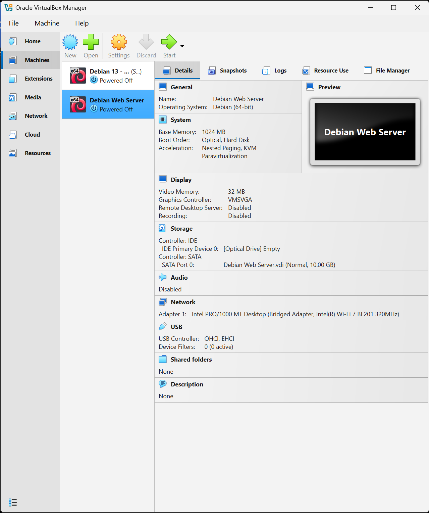

---

## 2. What is the Debian Login Screen?

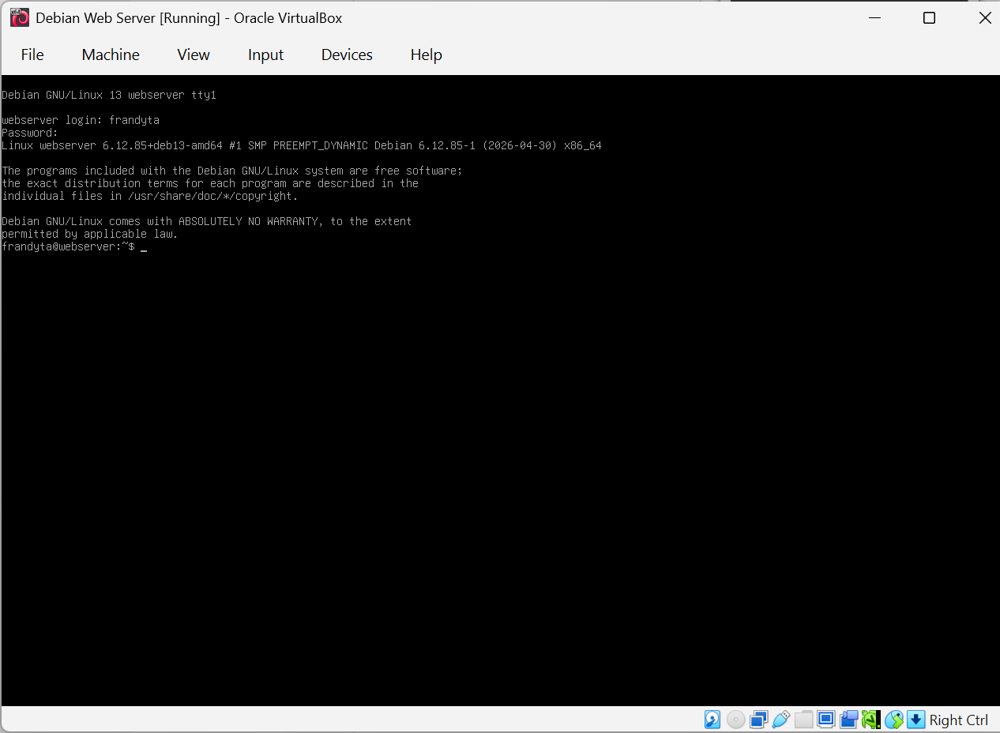

---

## 3. What is the IP address of your Debian Server Virtual Machine?

* The command used was `ip a`

```bash
ip a
```

* This command shows the network interfaces and IP addresses.

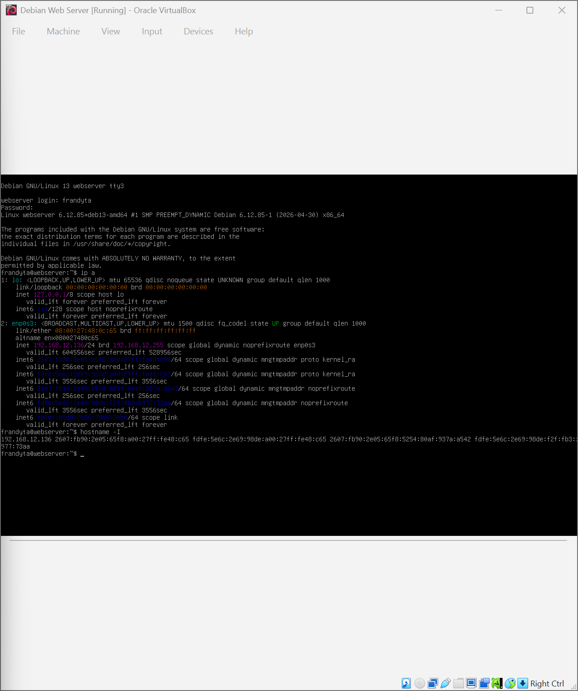

---

## 4. How do you work with the Firewall in Debian?

### Check if the Firewall is running

* The command is:

```bash
sudo ufw status
```

* This command checks if the firewall is active or inactive.

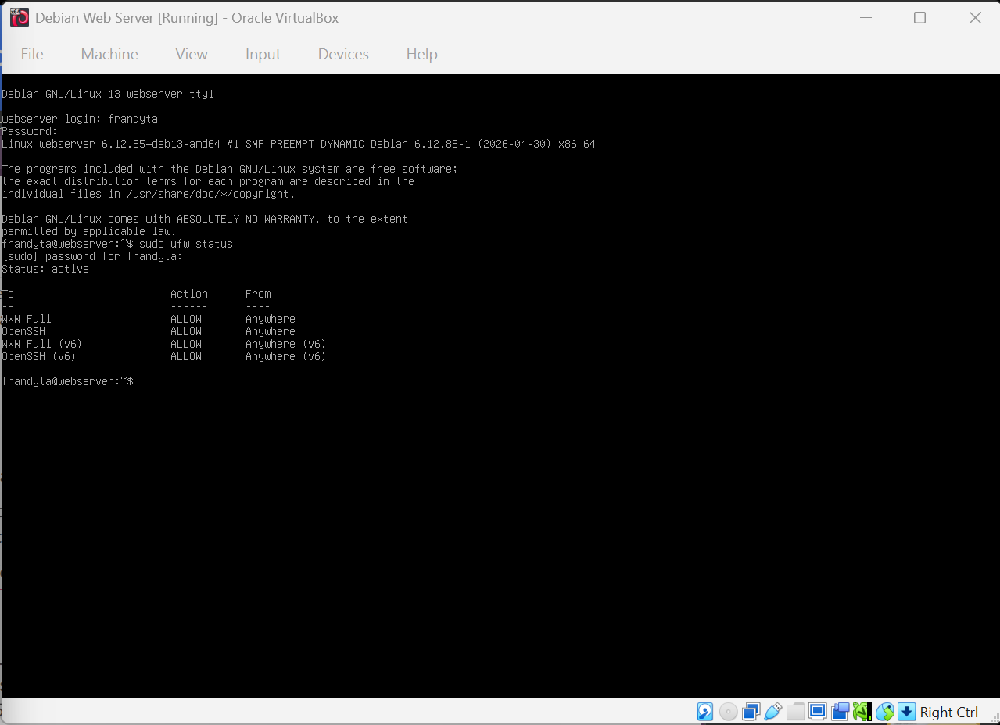

---

### Disable the Firewall

* The command is:

```bash
sudo ufw disable
```

* This command disables the firewall.

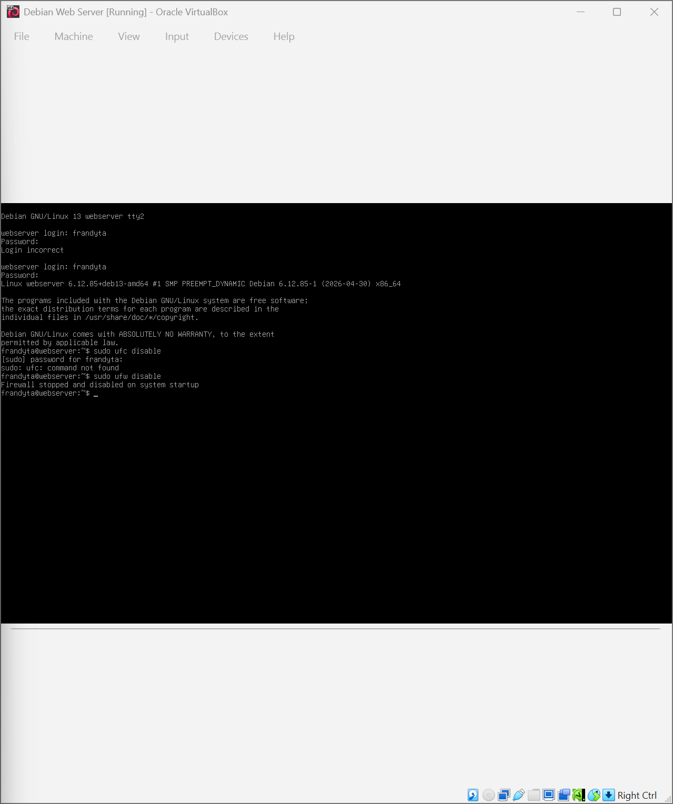

---

### Add Apache to the Firewall

* The command is:

```bash
sudo ufw allow 'Apache'
```

* This command allows Apache web traffic through the firewall.

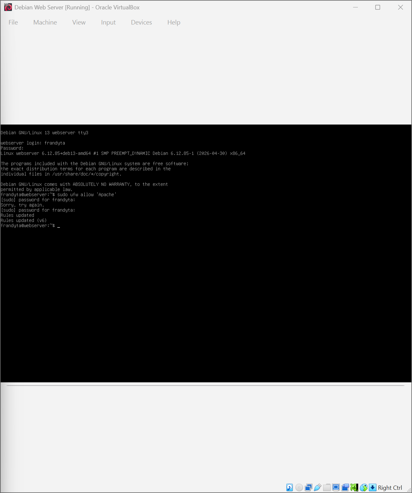

---

## 5. What different commands do we use to work with Apache?

### 1. What is the command you use to check if Apache is running?

* The command is:

```bash
sudo systemctl status apache2
```

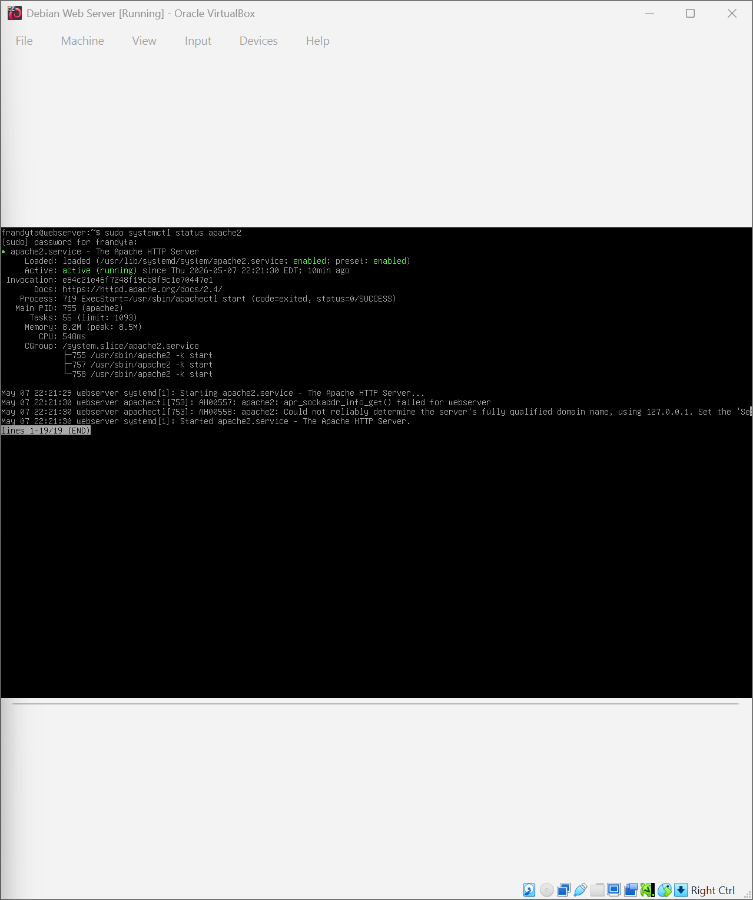

---

### 2. What is the command you use to stop Apache?

* The command is:

```bash
sudo systemctl stop apache2
```

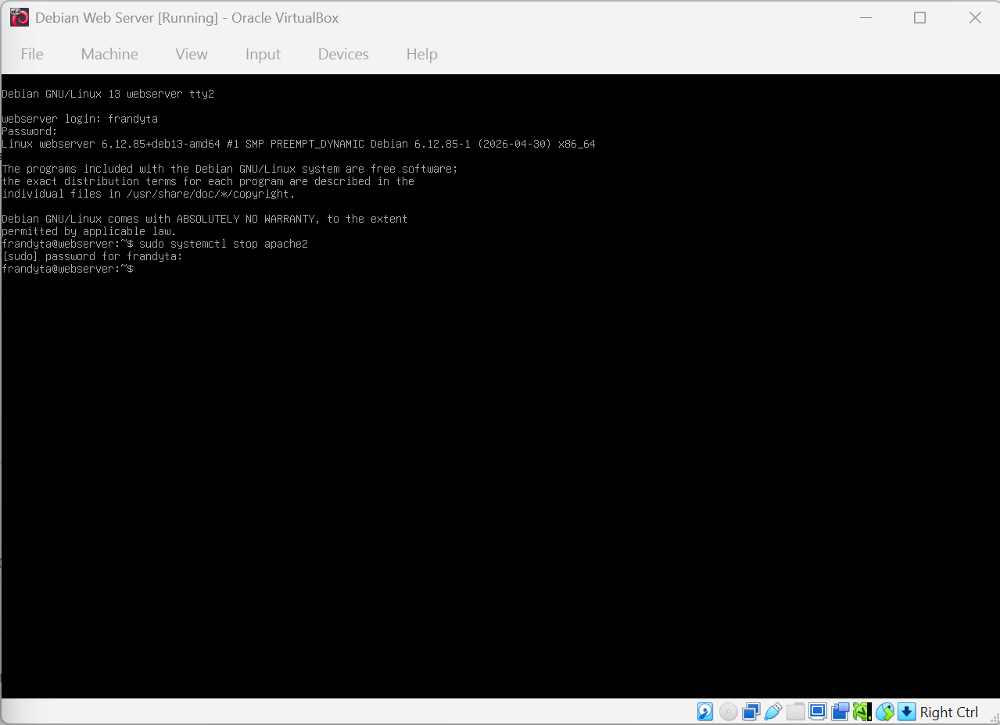

---

### 3. What is the command you use to restart Apache?

* The command is:

```bash
sudo systemctl restart apache2
```

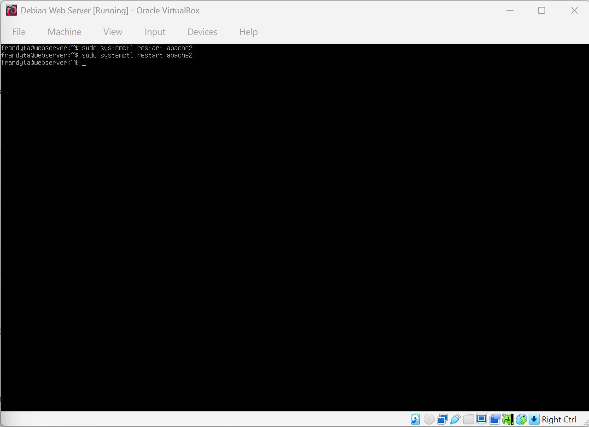

---

### 4. What is the command used to test Apache configuration?

* The command is:

```bash
sudo apachectl configtest
```

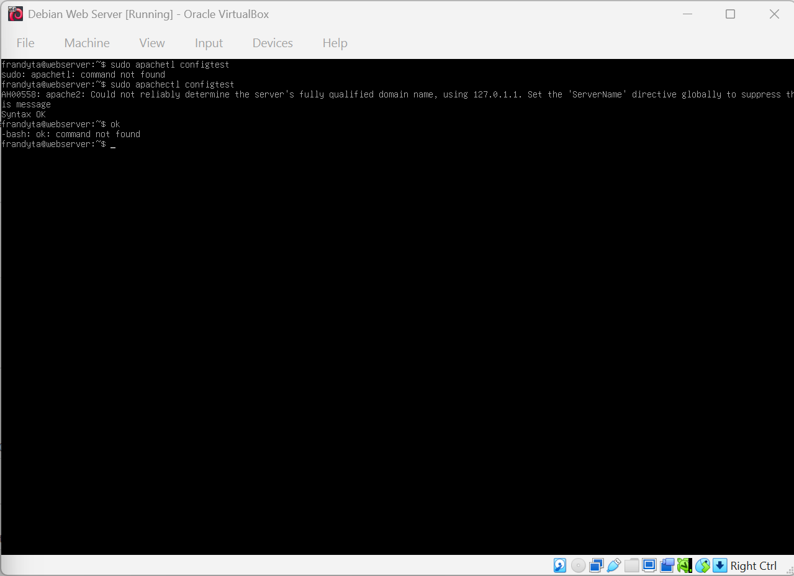

---

### 5. What is the command used to check the installed version of Apache?

* The command is:

```bash
apache2 -v
```

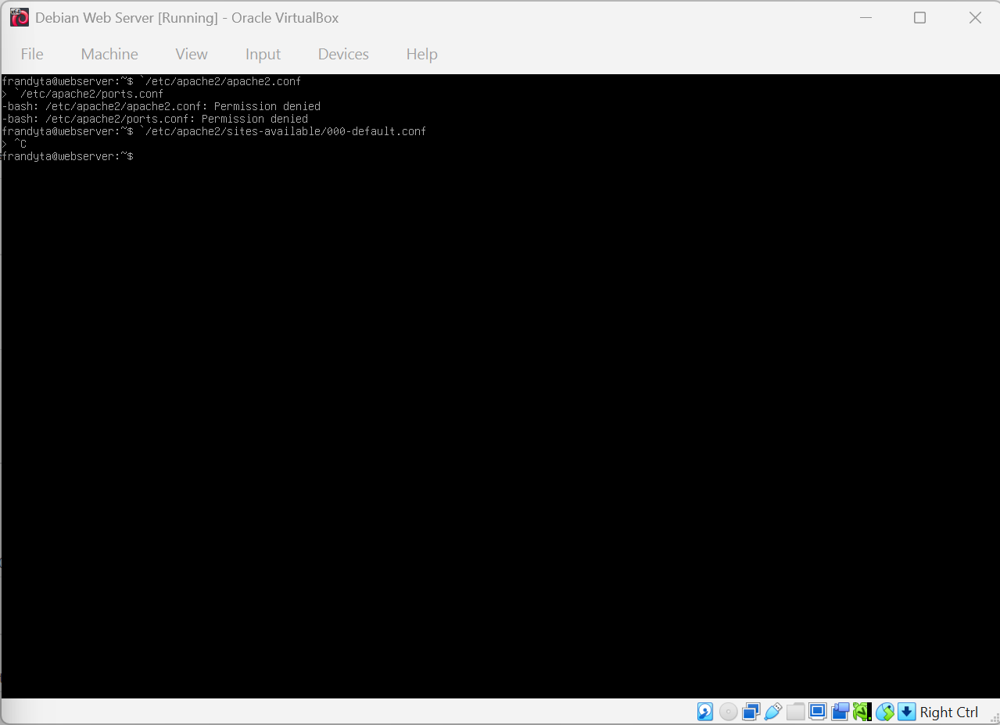

---

### 6. What are some common configuration files for Apache?

* `/etc/apache2/apache2.conf`
* `/etc/apache2/ports.conf`
* `/etc/apache2/sites-available/000-default.conf`


---

### 7. Where does Apache store logs?

* Apache stores logs in:

```bash
/var/log/apache2/
```

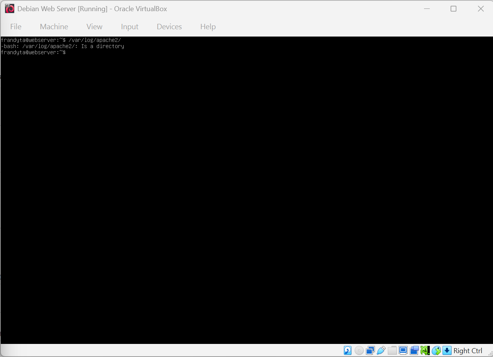

---

### 8. What are some basic commands we can use to review logs?

### View log file

```bash
cat /var/log/apache2/access.log
```

### View last lines

```bash
tail /var/log/apache2/error.log
```

### Monitor logs live

```bash
tail -f /var/log/apache2/access.log
```

