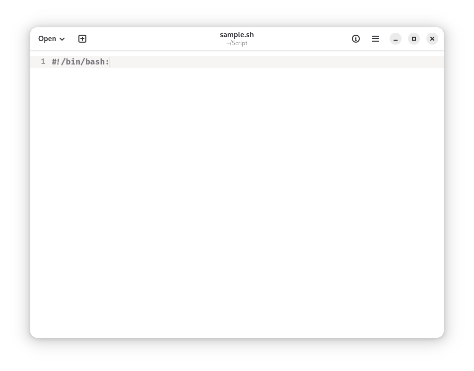
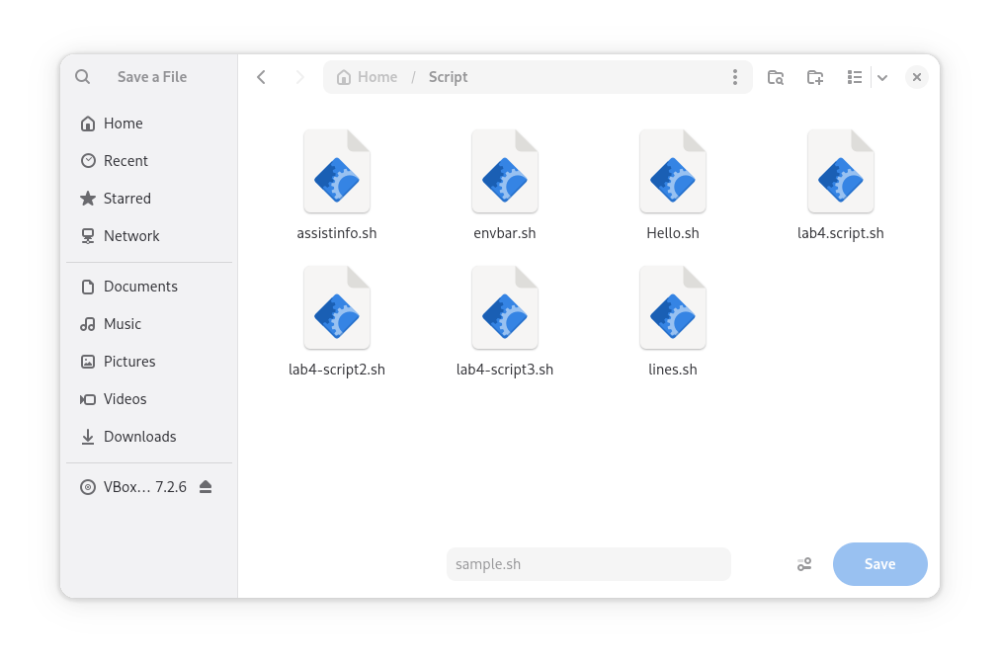
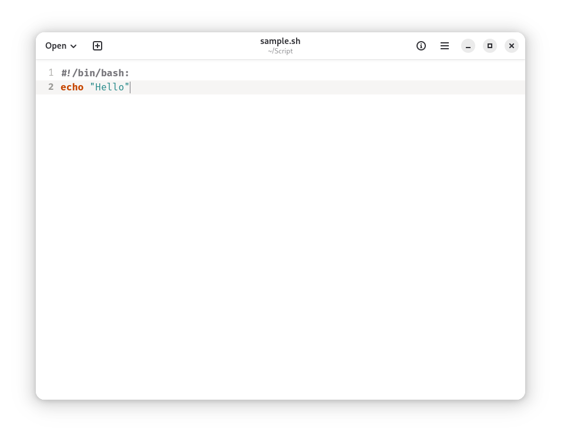
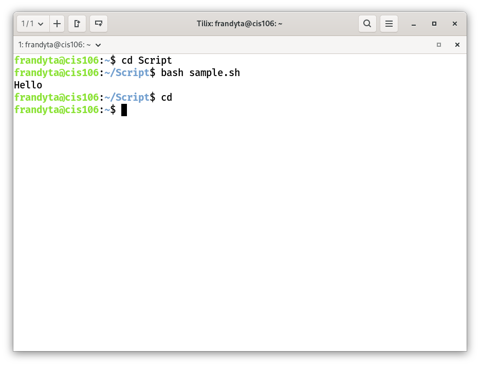

# What to include in Notes 4

## Anwser the following questions:

### 1. How to install and remove software using the APT command

* Installing packages:
sudo apt install +package

* Removing packages:
sudo apt remove +package
sudo apt purge +package

### 2. How to create a shell script step by step including screenshots and how to run it. Try to be as detailed as possible.
step 1: open the text editor and type the declaration statement: ```#!/bin/bash:```


Step 2: save the file on your script folder with the extension ```.sh```. (save it in a way you can remember because Linux is cases sensitive.)


Step 3: Start typing, for example :echo "Hello"


Step 4: Open your Terminal. Use the command: ```cd scripts/```, then Run the script using this command: ```bash sample.sh``` and it will display "Hello".
