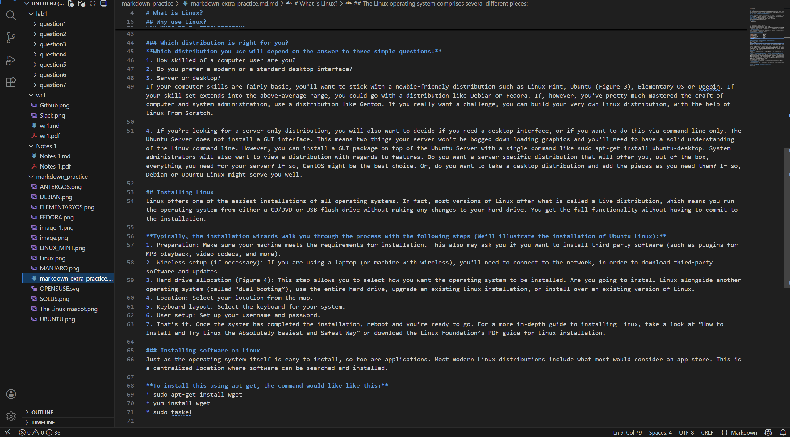

 

# What is Linux?
Just like Windows, iOS, and Mac OS, Linux is an operating system. In fact, one of the most popular platforms on the planet, Android, is powered by the Linux operating system. An operating system is software that manages all of the hardware resources associated with your desktop or laptop. To put it simply, the operating system manages the communication between your software and your hardware. Without the operating system (OS), the software wouldn’t function.

## The Linux operating system comprises several different pieces:

**Bootloader** –  The software that manages the boot process of your computer. 
**Kernel** – This is the one piece of the whole that is actually called ‘Linux’. The kernel is the core of the system and manages the CPU, memory, and peripheral devices. The kernel is the lowest level of the OS.
**Init system** – This is a sub-system that bootstraps the user space and is charged with controlling daemons. 
**Daemons** – These are background services (printing, sound, scheduling, etc.) 
**Graphical server** – This is the sub-system that displays the graphics on your monitor. 
**Desktop environment** – This is the piece that the users actually interact with. T
**Applications** – Desktop environments do not offer the full array of apps. Just like Windows and macOS, Linux offers thousands upon thousands of high-quality software titles that can be easily found and installed. 
## Why use Linux?
Linux has evolved into one of the most reliable computer ecosystems on the planet. Combine that reliability with zero cost of entry and you have the perfect solution for a desktop platform.

Linux is also distributed under an open source license. 

### Open source follows these key tenets:

1. The freedom to run the program, for any purpose.
2. The freedom to study how the program works, and change it to make it do what you wish.
3. The freedom to redistribute copies so you can help your neighbor.
4. The freedom to distribute copies of your modified versions to others.
5. These points are crucial to understanding the community that works together to create the Linux platform. Without a doubt, Linux is an operating system that is “by the people, for the people”. These tenets are also a main factor in why many people choose Linux. It’s about freedom and freedom of use and freedom of choice.

### What is a “distribution?”
Linux has a number of different versions to suit any type of user. From new users to hard-core users, you’ll find a “flavor” of Linux to match your needs. These versions are called distributions (or, in the short form, “distros”). Nearly every distribution of Linux can be downloaded for free, burned onto disk (or USB thumb drive), and installed (on as many machines as you like).

| **Popular Linux distributions include:** |               |
| ---------------------------------------- | ------------- |
|             | LINUX MINT    |
|                   | MANJARO       |
|                     | DEBIAN        |
|                     | UBUNTU        |
|                 | ANTERGOS      |
|                       | SOLUS         |
|                     | FEDORA        |
|         | ELEMENTARY OS |
|                 | OPENSUSE      |

### Which distribution is right for you?
**Which distribution you use will depend on the answer to three simple questions:**
1. How skilled of a computer user are you?
2. Do you prefer a modern or a standard desktop interface?
3. Server or desktop?
If your computer skills are fairly basic, you’ll want to stick with a newbie-friendly distribution such as Linux Mint, Ubuntu (Figure 3), Elementary OS or Deepin. If your skill set extends into the above-average range, you could go with a distribution like Debian or Fedora. If, however, you’ve pretty much mastered the craft of computer and system administration, use a distribution like Gentoo. If you really want a challenge, you can build your very own Linux distribution, with the help of Linux From Scratch.

4. If you’re looking for a server-only distribution, you will also want to decide if you need a desktop interface, or if you want to do this via command-line only. The Ubuntu Server does not install a GUI interface. This means two things your server won’t be bogged down loading graphics and you’ll need to have a solid understanding of the Linux command line. However, you can install a GUI package on top of the Ubuntu Server with a single command like sudo apt-get install ubuntu-desktop. System administrators will also want to view a distribution with regards to features. Do you want a server-specific distribution that will offer you, out of the box, everything you need for your server? If so, CentOS might be the best choice. Or, do you want to take a desktop distribution and add the pieces as you need them? If so, Debian or Ubuntu Linux might serve you well.

## Installing Linux
Linux offers one of the easiest installations of all operating systems. In fact, most versions of Linux offer what is called a Live distribution, which means you run the operating system from either a CD/DVD or USB flash drive without making any changes to your hard drive. You get the full functionality without having to commit to the installation. 

**Typically, the installation wizards walk you through the process with the following steps (We’ll illustrate the installation of Ubuntu Linux):**
1. Preparation: Make sure your machine meets the requirements for installation. This also may ask you if you want to install third-party software (such as plugins for MP3 playback, video codecs, and more).
2. Wireless setup (if necessary): If you are using a laptop (or machine with wireless), you’ll need to connect to the network, in order to download third-party software and updates.
3. Hard drive allocation (Figure 4): This step allows you to select how you want the operating system to be installed. Are you going to install Linux alongside another operating system (called “dual booting”), use the entire hard drive, upgrade an existing Linux installation, or install over an existing version of Linux.
4. Location: Select your location from the map.
5. Keyboard layout: Select the keyboard for your system.
6. User setup: Set up your username and password.
7. That’s it. Once the system has completed the installation, reboot and you’re ready to go. For a more in-depth guide to installing Linux, take a look at “How to Install and Try Linux the Absolutely Easiest and Safest Way” or download the Linux Foundation’s PDF guide for Linux installation.

### Installing software on Linux
Just as the operating system itself is easy to install, so too are applications. Most modern Linux distributions include what most would consider an app store. This is a centralized location where software can be searched and installed. 

**To install this using apt-get, the command would like like this:**
* sudo apt-get install wget
* yum install wget
* sudo taskel

## Desktop environment screenshots

